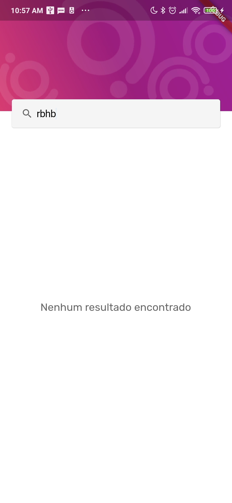

# The Company List

 

## The Result
- [x] Test (partial done).
- [x] Clean Architeture by Uncle bob (simplified removing entity for presentetation).
- [x] Bloc Pattern, Using my own lib to avoid boilerplate (FancyStream).

## Architecture

 
